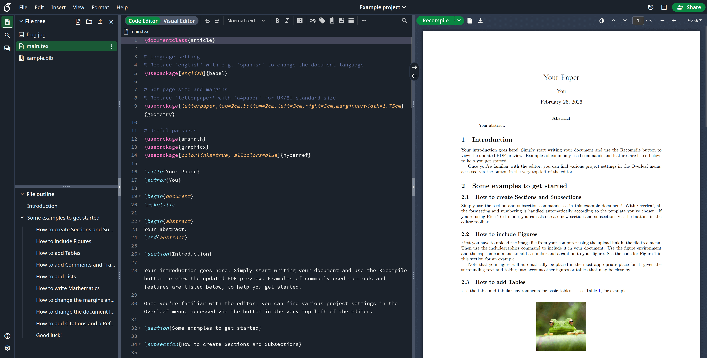

<h1 align="center">
   
  
</h1>

<h4 align="center">An open-source online real-time collaborative LaTeX editor.</h4>

  <a href="https://github.com/superpaper/superpaper/wiki">Wiki</a> •
  <a href="#contributing">Contributing</a> •
  <a href="#authors">Authors</a> •
  <a href="#license">License</a>

  Figure 1: A screenshot of a project being edited in superPaper Community Edition.

## Community Edition

[superPaper](https://www.superpaper.com) is an open-source online real-time collaborative LaTeX editor. We run a hosted version at [www.superpaper.com](https://www.superpaper.com), but you can also run your own local version, and contribute to the development of superPaper.

> [!CAUTION]
> superPaper Community Edition is intended for use in environments where **all** users are trusted. Community Edition is **not** appropriate for scenarios where isolation of users is required due to Sandbox Compiles not being available. When not using Sandboxed Compiles, users have full read and write access to the `sharelatex` container resources (filesystem, network, environment variables) when running LaTeX compiles.

For more information on Sandbox Compiles check out our [documentation](https://docs.superpaper.com/on-premises/configuration/superpaper-toolkit/server-pro-only-configuration/sandboxed-compiles).

## Installation

We have detailed installation instructions in the [superPaper Toolkit](https://github.com/superpaper/toolkit/).

## Upgrading

If you are upgrading from a previous version of superPaper, please see the [Release Notes section on the Wiki](https://github.com/superpaper/superpaper/wiki#release-notes) for all of the versions between your current version and the version you are upgrading to.

## superPaper Docker Image

This repo contains two dockerfiles, [`Dockerfile-base`](server-ce/Dockerfile-base), which builds the
`sharelatex/sharelatex-base` image, and [`Dockerfile`](server-ce/Dockerfile) which builds the
`sharelatex/sharelatex` (or "community") image.

The Base image generally contains the basic dependencies like `wget`, plus `texlive`.
We split this out because it's a pretty heavy set of
dependencies, and it's nice to not have to rebuild all of that every time.

The `sharelatex/sharelatex` image extends the base image and adds the actual superPaper code
and services.

Use `make build-base` and `make build-community` from `server-ce/` to build these images.

We use the [Phusion base-image](https://github.com/phusion/baseimage-docker)
(which is extended by our `base` image) to provide us with a VM-like container
in which to run the superPaper services. Baseimage uses the `runit` service
manager to manage services, and we add our init-scripts from the `server-ce/runit`
folder.

## Contributing

Please see the [CONTRIBUTING](CONTRIBUTING.md) file for information on contributing to the development of superPaper.

## Authors

[The superPaper Team](https://www.superpaper.com/about)

## License

The code in this repository is released under the GNU AFFERO GENERAL PUBLIC LICENSE, version 3. A copy can be found in the [`LICENSE`](LICENSE) file.

Copyright (c) superPaper, 2014-2025.
